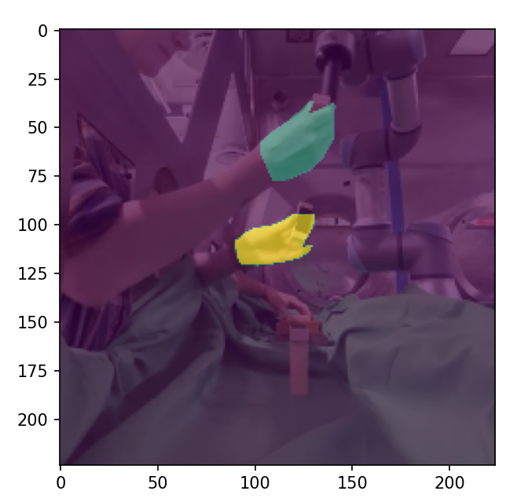

# assembly_hrc_data
Labelled data from HRC experiments to be used for semantic hand segmentation.

## Converting LabelMe Annotations to Trainable Dataset
Enter the following command into anaconda prompt in the project directory-
(where images and JSON annotations are under Labelled/train/images)
`./labelme2voc.py ./Labelled/train/images data_dataset_voc --labels labels.txt`

`conda env create -f environment.yml`

Then, visualize data by running `dataloader.py`.

## Credits
labelme2voc.py from https://github.com/wkentaro/labelme/tree/main/examples/semantic_segmentation

